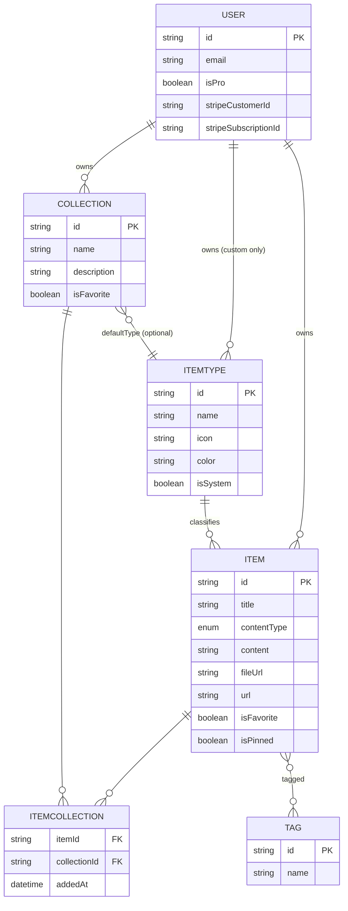
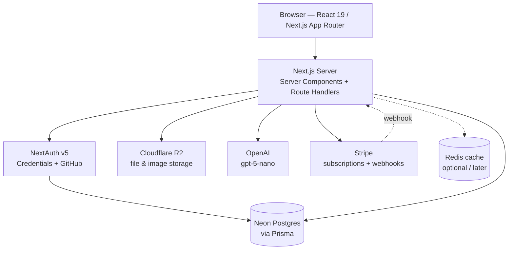

# DevStash — Project Overview

> **Status:** Planning / pre-build
> **Type:** Freemium SaaS
> **One-liner:** One fast, searchable, AI-enhanced hub for everything a developer stashes.

---

## 1. Problem

Developers keep their essentials scattered across too many tools:

| What              | Where it usually lives          |
| ----------------- | ------------------------------- |
| Code snippets     | VS Code, Notion                 |
| AI prompts        | Chat histories                  |
| Context files     | Buried in project folders       |
| Useful links      | Browser bookmarks               |
| Docs & notes      | Random folders                  |
| Shell commands    | `.txt` files, `~/.bash_history` |
| Project templates | GitHub Gists                    |

The result is constant context switching, lost knowledge, and inconsistent workflows.

**DevStash solves this** by giving developers a single searchable home for snippets, prompts, commands, links, notes and files — with AI layered on top.

---

## 2. Target Users

| Persona                        | Primary need                                             |
| ------------------------------ | -------------------------------------------------------- |
| **Everyday Developer**         | Fast grab-and-go access to snippets, commands, links     |
| **AI-first Developer**         | Store prompts, context files, system messages, workflows |
| **Content Creator / Educator** | Keep code blocks, explanations, course notes organized   |
| **Full-stack Builder**         | Collect patterns, boilerplates, API examples             |

---

## 3. Features

### A. Items & Item Types

Everything stored in DevStash is an **item**. Every item has a **type**.

System types (immutable, seeded at install):

| Type    | Content type | Color             | Icon (lucide) | Route             | Tier    |
| ------- | ------------ | ----------------- | ------------- | ----------------- | ------- |
| Snippet | text         | `#3b82f6` blue    | `Code`        | `/items/snippets` | Free    |
| Prompt  | text         | `#8b5cf6` purple  | `Sparkles`    | `/items/prompts`  | Free    |
| Note    | text         | `#fde047` yellow  | `StickyNote`  | `/items/notes`    | Free    |
| Command | text         | `#f97316` orange  | `Terminal`    | `/items/commands` | Free    |
| Link    | url          | `#10b981` emerald | `Link`        | `/items/links`    | Free    |
| File    | file         | `#6b7280` gray    | `File`        | `/items/files`    | **Pro** |
| Image   | file         | `#ec4899` pink    | `Image`       | `/items/images`   | **Pro** |

- Custom user-defined types come later (Pro).
- Items are created and opened in a **quick-access drawer**, not a full page navigation.

### B. Collections

- A collection groups items of **any** type.
- An item can belong to **multiple** collections (e.g. a React snippet in both _React Patterns_ and _Interview Prep_).
- Examples: `React Patterns`, `Context Files`, `Python Snippets`.

### C. Search

Powerful search across **content**, **tags**, **titles**, and **types**.
_(Start with Postgres full-text search; revisit a dedicated index only if it becomes a bottleneck.)_

### D. Authentication

- Email + password
- GitHub OAuth

### E. Quality-of-life Features

- Favorite collections and items
- Pin items to top
- Recently used
- Import code from a file
- Markdown editor for text types
- File upload for file/image types
- Export data (JSON / ZIP)
- Dark mode by default, light mode optional
- Add/remove items to/from multiple collections
- View which collections an item belongs to

### F. AI Features (Pro)

- Auto-tag suggestions
- Summaries
- "Explain this code"
- Prompt optimizer

---

## 4. Data Model

### Entity relationship diagram



### Prisma schema — ROUGH DRAFT

> ⚠️ **This is a rough draft, not final.** Field names, indexes, and cascade
> behavior will change once the app is scaffolded. NextAuth v5 models
> (`Account`, `Session`, `VerificationToken`) are omitted for brevity — pull them
> from the current `@auth/prisma-adapter` docs when generating for real.

```prisma
// schema.prisma — DRAFT

generator client {
  provider = "prisma-client"
  output   = "../src/generated/prisma"
}

datasource db {
  provider = "postgresql"
  url      = env("DATABASE_URL")
}

enum ContentType {
  text
  file
  url
}

model User {
  id                   String   @id @default(cuid())
  name                 String?
  email                String   @unique
  emailVerified        DateTime?
  image                String?
  password             String?  // null for OAuth-only users
  isPro                Boolean  @default(false)
  stripeCustomerId     String?  @unique
  stripeSubscriptionId String?  @unique
  createdAt            DateTime @default(now())
  updatedAt            DateTime @updatedAt

  items       Item[]
  collections Collection[]
  itemTypes   ItemType[]   // custom types only
  // accounts  Account[]
  // sessions  Session[]
}

model ItemType {
  id       String  @id @default(cuid())
  name     String
  icon     String  // lucide icon name, e.g. "Code"
  color    String  // hex, e.g. "#3b82f6"
  isSystem Boolean @default(false)
  userId   String? // null for system types
  user     User?   @relation(fields: [userId], references: [id], onDelete: Cascade)

  items              Item[]
  defaultCollections Collection[] @relation("CollectionDefaultType")

  @@unique([userId, name])
  @@index([userId])
}

model Item {
  id          String      @id @default(cuid())
  title       String
  contentType ContentType @default(text)
  content     String?     // text body, null for file items
  fileUrl     String?     // R2 object URL
  fileName    String?
  fileSize    Int?        // bytes
  url         String?     // for link items
  description String?
  language    String?     // for syntax highlighting
  isFavorite  Boolean     @default(false)
  isPinned    Boolean     @default(false)
  lastUsedAt  DateTime?   // powers "recently used"
  createdAt   DateTime    @default(now())
  updatedAt   DateTime    @updatedAt

  userId     String
  user       User     @relation(fields: [userId], references: [id], onDelete: Cascade)
  itemTypeId String
  itemType   ItemType @relation(fields: [itemTypeId], references: [id])

  tags        Tag[]
  collections ItemCollection[]

  @@index([userId, createdAt])
  @@index([userId, itemTypeId])
}

model Collection {
  id          String   @id @default(cuid())
  name        String
  description String?
  isFavorite  Boolean  @default(false)
  createdAt   DateTime @default(now())
  updatedAt   DateTime @updatedAt

  userId        String
  user          User      @relation(fields: [userId], references: [id], onDelete: Cascade)
  defaultTypeId String?
  defaultType   ItemType? @relation("CollectionDefaultType", fields: [defaultTypeId], references: [id])

  items ItemCollection[]

  @@unique([userId, name])
  @@index([userId])
}

model ItemCollection {
  itemId       String
  collectionId String
  addedAt      DateTime @default(now())

  item       Item       @relation(fields: [itemId], references: [id], onDelete: Cascade)
  collection Collection @relation(fields: [collectionId], references: [id], onDelete: Cascade)

  @@id([itemId, collectionId])
  @@index([collectionId])
}

model Tag {
  id    String @id @default(cuid())
  name  String @unique
  items Item[]
}
```

**Open questions on the schema**

- Should tags be global or scoped per user? (Global is simpler; per-user avoids leaking one user's tag vocabulary into another's autocomplete.) → _leaning per-user, `@@unique([userId, name])`_
- Is `contentType` on `Item` redundant with `ItemType`, or does it need to stay so custom types can declare their storage shape? → _keep it; custom types will need it_
- Soft delete / trash before hard delete?

---

## 5. Architecture



### Route sketch

| Route                             | Purpose                                    |
| --------------------------------- | ------------------------------------------ |
| `/`                               | Marketing / landing                        |
| `/dashboard`                      | Collection grid + recent items             |
| `/items`                          | All items                                  |
| `/items/[type]`                   | Items filtered by type (`/items/snippets`) |
| `/collections`                    | All collections                            |
| `/collections/[id]`               | Single collection                          |
| `/search`                         | Search results                             |
| `/settings`                       | Account, theme, export                     |
| `/settings/billing`               | Stripe portal                              |
| `/api/items` · `/api/collections` | CRUD route handlers                        |
| `/api/upload`                     | R2 presigned upload                        |
| `/api/ai/[action]`                | tag / summarize / explain / optimize       |
| `/api/webhooks/stripe`            | Subscription lifecycle                     |

Individual items always open in a **drawer** overlaid on the current route (with a shareable deep link), never a hard navigation.

---

## 6. Tech Stack

| Layer        | Choice                                 | Notes                                                                                                   |
| ------------ | -------------------------------------- | ------------------------------------------------------------------------------------------------------- |
| Framework    | **Next.js 16 / React 19**              | App Router, server components, route handlers for the backend. Single repo.                             |
| Language     | **TypeScript**                         | Strict mode                                                                                             |
| Database     | **Neon Postgres**                      | Serverless, branchable                                                                                  |
| ORM          | **Prisma 7**                           | 🔗 Fetch the latest docs before scaffolding — Prisma 7 changed generator output and client import paths |
| Cache        | **Redis**                              | _Maybe_ — only if search/dashboard queries get slow                                                     |
| File storage | **Cloudflare R2**                      | S3-compatible; presigned uploads                                                                        |
| Auth         | **NextAuth v5 (Auth.js)**              | Credentials + GitHub OAuth                                                                              |
| AI           | **OpenAI `gpt-5-nano`**                | Cheap model; all calls server-side only                                                                 |
| Payments     | **Stripe**                             | Checkout + customer portal + webhooks                                                                   |
| Styling      | **Tailwind CSS v4 + shadcn/ui**        | CSS-first config in v4                                                                                  |
| Code display | Syntax highlighter (Shiki recommended) | Server-rendered, zero client JS                                                                         |

### 🚨 Non-negotiable rules

> **NEVER use `prisma db push` or modify the database structure directly.**
> All schema changes go through migrations (`prisma migrate dev` locally,
> `prisma migrate deploy` in production). No exceptions.

- Never expose the OpenAI key client-side. All AI calls go through `/api/ai/*`.
- Enforce tier limits **server-side**, not just in the UI.

### Reference links

- Next.js — https://nextjs.org/docs
- Prisma — https://www.prisma.io/docs
- Neon — https://neon.tech/docs
- NextAuth / Auth.js v5 — https://authjs.dev
- Tailwind CSS v4 — https://tailwindcss.com/docs
- shadcn/ui — https://ui.shadcn.com
- lucide icons — https://lucide.dev/icons
- Cloudflare R2 — https://developers.cloudflare.com/r2
- Stripe subscriptions — https://docs.stripe.com/billing/subscriptions/overview
- OpenAI API — https://platform.openai.com/docs

---

## 7. Monetization

Freemium.

|                        | **Free**              | **Pro — $8/mo or $72/yr** |
| ---------------------- | --------------------- | ------------------------- |
| Items                  | 50 total              | Unlimited                 |
| Collections            | 3                     | Unlimited                 |
| System types           | All except file/image | All                       |
| File & image uploads   | ❌                    | ✅                        |
| Search                 | Basic                 | Full                      |
| AI auto-tagging        | ❌                    | ✅                        |
| AI code explanation    | ❌                    | ✅                        |
| AI prompt optimizer    | ❌                    | ✅                        |
| Custom types           | ❌                    | ✅ _(later release)_      |
| Data export (JSON/ZIP) | ❌                    | ✅                        |
| Support                | Community             | Priority                  |

> **During development:** build the Pro plumbing (`isPro` flag, gate helpers,
> Stripe scaffolding) but leave every feature unlocked for all users. Flip the
> gates on at launch.

Suggested pattern: a single `canUse(user, feature)` helper plus a `requirePro()`
guard in route handlers, so gating is one line at each call site.

---

## 8. UI / UX

### General direction

- Modern, minimal, developer-focused
- **Dark mode by default**, light mode optional
- Clean typography, generous whitespace
- Subtle borders and shadows
- Syntax highlighting on all code blocks
- References: **Notion**, **Linear**, **Raycast**

### Layout

```
┌──────────────┬─────────────────────────────────────────┐
│  SIDEBAR     │  MAIN                                   │
│  (collapse)  │                                         │
│              │  ┌───────┐ ┌───────┐ ┌───────┐          │
│  Item types  │  │Collect│ │Collect│ │Collect│  ← bg    │
│   Snippets   │  │ card  │ │ card  │ │ card  │  color   │
│   Prompts    │  └───────┘ └───────┘ └───────┘          │
│   Commands   │                                         │
│   Notes      │  ┌───────┐ ┌───────┐ ┌───────┐          │
│   Links      │  │ item  │ │ item  │ │ item  │  ← border│
│   Files      │  └───────┘ └───────┘ └───────┘  color   │
│   Images     │                                         │
│              │                                         │
│  Recent      │        ┌──────────────────┐             │
│  collections │        │  ITEM DRAWER  ►  │             │
└──────────────┴────────┴──────────────────┴─────────────┘
```

- **Sidebar:** item types (linking to `/items/[type]`), latest collections. Collapsible.
- **Main:** grid of collection cards, **background** color-coded by the type the collection holds most of. Items appear below as cards with a **border** color matching their type.
- **Drawer:** individual items open in a fast side drawer for view/edit.

### Responsive

- Desktop-first, fully usable on mobile
- Sidebar collapses into a drawer on mobile

### Micro-interactions

- Smooth transitions
- Hover states on cards
- Toast notifications for actions
- Loading skeletons

---

## 9. Suggested Build Order

| Phase                | Scope                                                                                                                   |
| -------------------- | ----------------------------------------------------------------------------------------------------------------------- |
| **0 — Foundation**   | Next.js + TS + Tailwind v4 + shadcn setup, Neon connection, Prisma schema + **first migration**, seed system item types |
| **1 — Auth**         | NextAuth v5, credentials + GitHub, protected routes, user menu                                                          |
| **2 — Core CRUD**    | Items (text types only), item drawer, markdown editor, syntax highlighting                                              |
| **3 — Organization** | Collections, join-table membership, favorites, pinning, recently used                                                   |
| **4 — Search**       | Postgres full-text across title/content/tags/type, tag management                                                       |
| **5 — Files**        | R2 presigned uploads, file & image types, import code from file                                                         |
| **6 — AI**           | `/api/ai/*` — auto-tag, summarize, explain, prompt optimizer                                                            |
| **7 — Billing**      | Stripe checkout + portal + webhooks, flip on tier gating, export (JSON/ZIP)                                             |
| **8 — Polish**       | Light mode, mobile drawer, skeletons, toasts, empty states, onboarding                                                  |

---

## 10. Open Questions

- Are tags global or per-user? _(see schema notes)_
- Does search need ranking/highlighting from day one, or is `ILIKE` fine for v1?
- Where does the 50-item free limit get enforced — creation only, or also on import?
- Do deleted items go to a trash with a retention window?
- Public sharing of a single item or collection — in scope, or a later feature?
- Does a CLI or VS Code extension belong on the roadmap? (Strong differentiator for the "everyday developer" persona.)
